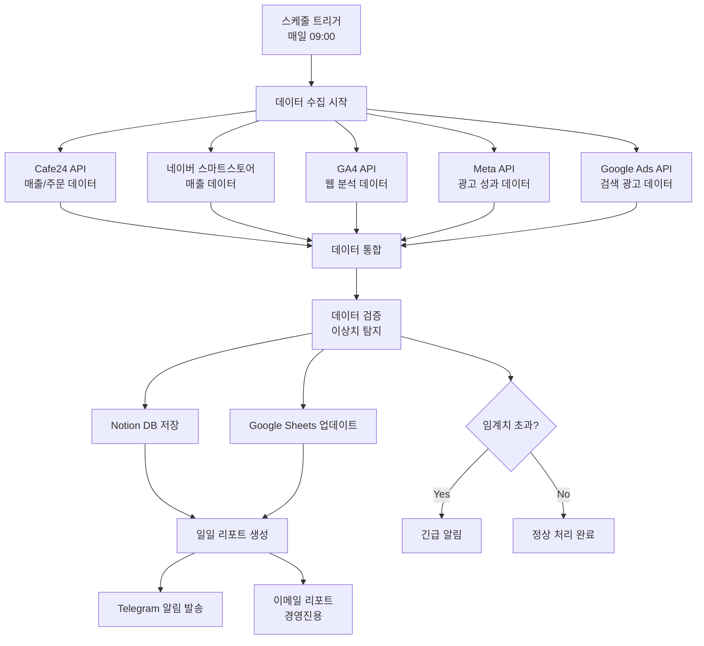

# n8n 일일 데이터 수집 워크플로우

> 이미커피 이커머스 핵심 지표 자동 수집 및 분석

## 🎯 워크플로우 목적

### 자동 수집 데이터
- **매출 데이터**: Cafe24, 네이버 스마트스토어 매출
- **웹 분석**: GA4 트래픽, 전환율, 행동 데이터  
- **광고 성과**: Meta Ads, Google Ads, 네이버 쇼핑 ROAS
- **고객 데이터**: 신규/기존 고객, 재구매율
- **운영 데이터**: 주문 처리, 재고, 고객 문의

### 실행 스케줄
- **매일 오전 9시**: 전날 성과 데이터 수집
- **실시간**: 중요 알림 (매출 급감, 사이트 오류 등)
- **주간**: 일요일 저녁 주간 종합 분석
- **월간**: 매월 1일 월간 리포트 생성

## 🔧 워크플로우 구조



## 📊 1. Cafe24 데이터 수집 노드

### HTTP Request 노드 설정
```json
{
  "node": "Cafe24 매출 데이터",
  "method": "GET",
  "url": "https://{{shop_id}}.cafe24api.com/api/v2/admin/orders",
  "headers": {
    "Authorization": "Bearer {{cafe24_access_token}}",
    "Content-Type": "application/json",
    "X-Cafe24-Api-Version": "2022-03-01"
  },
  "parameters": {
    "start_date": "{{$now.minus({days: 1}).toFormat('yyyy-MM-dd')}}",
    "end_date": "{{$now.minus({days: 1}).toFormat('yyyy-MM-dd')}}",
    "limit": 100,
    "offset": 0,
    "order_status": "shipped,delivered"
  }
}
```

### 데이터 변환 (Function 노드)
```javascript
// Cafe24 데이터 정제
const orders = items[0].json.orders;
let totalRevenue = 0;
let orderCount = 0;
let totalItems = 0;

const processedOrders = orders.map(order => {
  const revenue = parseFloat(order.order_price_amount);
  totalRevenue += revenue;
  orderCount++;
  totalItems += order.items.length;
  
  return {
    order_id: order.order_id,
    order_date: order.order_date,
    customer_id: order.member_id,
    revenue: revenue,
    items_count: order.items.length,
    payment_method: order.payment_method,
    shipping_cost: parseFloat(order.shipping_cost || 0),
    discount_amount: parseFloat(order.discount_amount || 0)
  };
});

// 요약 통계
const summary = {
  date: new Date().toISOString().split('T')[0],
  platform: 'cafe24',
  total_revenue: totalRevenue,
  order_count: orderCount,
  average_order_value: orderCount > 0 ? totalRevenue / orderCount : 0,
  total_items: totalItems
};

return [{
  json: {
    summary: summary,
    orders: processedOrders
  }
}];
```

## 📈 2. GA4 데이터 수집 노드

### Google Analytics API 설정
```json
{
  "node": "GA4 웹 분석",
  "method": "POST", 
  "url": "https://analyticsdata.googleapis.com/v1beta/properties/{{ga4_property_id}}:runReport",
  "headers": {
    "Authorization": "Bearer {{google_access_token}}",
    "Content-Type": "application/json"
  },
  "body": {
    "dateRanges": [
      {
        "startDate": "yesterday",
        "endDate": "yesterday"
      }
    ],
    "metrics": [
      {"name": "sessions"},
      {"name": "users"},
      {"name": "newUsers"},
      {"name": "pageviews"},
      {"name": "bounceRate"},
      {"name": "averageSessionDuration"},
      {"name": "ecommercePurchases"},
      {"name": "purchaseRevenue"},
      {"name": "addToCarts"}
    ],
    "dimensions": [
      {"name": "source"},
      {"name": "medium"},
      {"name": "campaign"}
    ]
  }
}
```

### GA4 데이터 처리
```javascript
// GA4 응답 데이터 처리
const reportData = items[0].json;
const rows = reportData.rows || [];

let webAnalytics = {
  date: new Date().toISOString().split('T')[0],
  total_sessions: 0,
  total_users: 0,
  new_users: 0,
  pageviews: 0,
  bounce_rate: 0,
  avg_session_duration: 0,
  purchases: 0,
  purchase_revenue: 0,
  add_to_carts: 0,
  conversion_rate: 0,
  channels: []
};

rows.forEach(row => {
  const metrics = row.metricValues;
  const dimensions = row.dimensionValues;
  
  const channelData = {
    source: dimensions[0].value,
    medium: dimensions[1].value,
    campaign: dimensions[2].value,
    sessions: parseInt(metrics[0].value),
    users: parseInt(metrics[1].value),
    purchases: parseInt(metrics[6].value),
    revenue: parseFloat(metrics[7].value || 0)
  };
  
  webAnalytics.channels.push(channelData);
  webAnalytics.total_sessions += channelData.sessions;
  webAnalytics.total_users += channelData.users;
  webAnalytics.purchases += channelData.purchases;
  webAnalytics.purchase_revenue += channelData.revenue;
});

// 전환율 계산
webAnalytics.conversion_rate = webAnalytics.total_sessions > 0 
  ? (webAnalytics.purchases / webAnalytics.total_sessions * 100).toFixed(2)
  : 0;

return [{json: webAnalytics}];
```

## 🎯 3. 광고 성과 데이터 수집

### Meta Ads 데이터
```json
{
  "node": "Meta 광고 성과",
  "method": "GET",
  "url": "https://graph.facebook.com/v18.0/{{ad_account_id}}/insights",
  "headers": {
    "Authorization": "Bearer {{meta_access_token}}"
  },
  "parameters": {
    "time_range": "{'since':'{{$now.minus({days: 1}).toFormat('yyyy-MM-dd')}}','until':'{{$now.minus({days: 1}).toFormat('yyyy-MM-dd')}}'}",
    "fields": "campaign_name,spend,impressions,clicks,ctr,cpm,cpc,actions,action_values",
    "action_attribution_windows": "28d_click",
    "breakdowns": "campaign_name"
  }
}
```

### Google Ads 데이터
```json
{
  "node": "Google Ads 성과",
  "method": "POST",
  "url": "https://googleads.googleapis.com/v14/customers/{{customer_id}}/googleAds:search",
  "headers": {
    "Authorization": "Bearer {{google_ads_token}}",
    "developer-token": "{{developer_token}}"
  },
  "body": {
    "query": "SELECT campaign.name, metrics.impressions, metrics.clicks, metrics.cost_micros, metrics.conversions, metrics.conversions_value FROM campaign_performance_view WHERE segments.date = '{{$now.minus({days: 1}).toFormat('yyyy-MM-dd')}}'"
  }
}
```

## 📝 4. 데이터 통합 및 저장

### Notion 데이터베이스 저장
```javascript
// Notion API를 통한 일일 성과 저장
const notionData = {
  parent: {database_id: "{{notion_db_id}}"},
  properties: {
    "날짜": {
      date: {
        start: items[0].json.date
      }
    },
    "총 매출": {
      number: items[0].json.total_revenue
    },
    "주문 수": {
      number: items[0].json.order_count
    },
    "전환율": {
      number: parseFloat(items[0].json.conversion_rate)
    },
    "방문자 수": {
      number: items[1].json.total_users
    },
    "ROAS": {
      number: calculateROAS(items[0].json.total_revenue, items[2].json.total_spend)
    },
    "CAC": {
      number: calculateCAC(items[2].json.total_spend, items[1].json.new_users)
    }
  }
};

function calculateROAS(revenue, spend) {
  return spend > 0 ? (revenue / spend * 100).toFixed(2) : 0;
}

function calculateCAC(spend, newUsers) {
  return newUsers > 0 ? (spend / newUsers).toFixed(0) : 0;
}

return [{json: notionData}];
```

### Google Sheets 업데이트
```javascript
// Google Sheets 일일 데이터 추가
const sheetData = [
  [
    new Date().toISOString().split('T')[0], // 날짜
    items[0].json.total_revenue,           // 매출
    items[0].json.order_count,             // 주문 수
    items[1].json.total_sessions,          // 세션
    items[1].json.conversion_rate,         // 전환율
    items[2].json.meta_spend,              // Meta 광고비
    items[3].json.google_spend,            // Google 광고비
    calculateROAS(),                        // 전체 ROAS
    items[1].json.new_users               // 신규 고객
  ]
];

return [{
  json: {
    range: 'Daily_Data!A:I',
    values: sheetData,
    valueInputOption: 'RAW'
  }
}];
```

## 📧 5. 알림 및 리포트 생성

### 일일 리포트 생성 (Function 노드)
```javascript
// 일일 성과 리포트 템플릿
const reportData = items[0].json;
const yesterday = new Date(Date.now() - 24*60*60*1000).toLocaleDateString('ko-KR');

const report = `
📊 **이미커피 일일 성과 리포트** - ${yesterday}

💰 **매출 현황**
• 총 매출: ${reportData.total_revenue.toLocaleString()}원
• 주문 수: ${reportData.order_count}건
• 평균 주문가: ${Math.round(reportData.total_revenue/reportData.order_count).toLocaleString()}원

📈 **웹사이트 성과**  
• 방문자: ${reportData.total_users.toLocaleString()}명
• 세션: ${reportData.total_sessions.toLocaleString()}회
• 전환율: ${reportData.conversion_rate}%

🎯 **광고 성과**
• Meta ROAS: ${reportData.meta_roas}%
• Google ROAS: ${reportData.google_roas}%
• 신규 고객: ${reportData.new_users}명

${reportData.alerts.length > 0 ? `⚠️ **주의사항**\n${reportData.alerts.join('\n')}` : ''}

📊 상세 분석: ${reportData.dashboard_url}
`;

return [{json: {report: report}}];
```

### Telegram 알림 발송
```json
{
  "node": "Telegram 알림",
  "method": "POST",
  "url": "https://api.telegram.org/bot{{telegram_token}}/sendMessage",
  "body": {
    "chat_id": "{{telegram_chat_id}}",
    "text": "{{$node['리포트 생성'].json.report}}",
    "parse_mode": "Markdown"
  }
}
```

## ⚠️ 6. 이상치 탐지 및 긴급 알림

### 임계치 설정
```javascript
// 이상 상황 탐지 로직
const currentData = items[0].json;
const thresholds = {
  min_daily_revenue: 300000,      // 최소 일일 매출
  max_cac: 20000,                 // 최대 고객획득비용  
  min_conversion_rate: 1.8,       // 최소 전환율
  max_bounce_rate: 75,            // 최대 이탈률
  min_roas: 300                   // 최소 ROAS
};

const alerts = [];

// 매출 급감 체크
if (currentData.total_revenue < thresholds.min_daily_revenue) {
  alerts.push(`🚨 매출 급감: ${currentData.total_revenue.toLocaleString()}원 (기준: ${thresholds.min_daily_revenue.toLocaleString()}원)`);
}

// 전환율 급감 체크
if (currentData.conversion_rate < thresholds.min_conversion_rate) {
  alerts.push(`📉 전환율 하락: ${currentData.conversion_rate}% (기준: ${thresholds.min_conversion_rate}%)`);
}

// ROAS 급감 체크
if (currentData.total_roas < thresholds.min_roas) {
  alerts.push(`💸 ROAS 하락: ${currentData.total_roas}% (기준: ${thresholds.min_roas}%)`);
}

return [{
  json: {
    has_alerts: alerts.length > 0,
    alerts: alerts,
    data: currentData
  }
}];
```

### 긴급 알림 전송
```javascript
// 긴급 상황 알림
if (items[0].json.has_alerts) {
  const urgentMessage = `
🚨 **이미커피 긴급 알림**

${items[0].json.alerts.join('\n')}

즉시 확인 및 대응이 필요합니다.
대시보드: ${dashboard_url}
  `;
  
  // 여러 채널로 긴급 알림
  return [{
    json: {
      telegram_message: urgentMessage,
      email_subject: '[긴급] 이미커피 이커머스 이상 징후 탐지',
      email_body: urgentMessage,
      sms_message: '이미커피 이커머스 이상 징후 탐지. 즉시 확인 바랍니다.'
    }
  }];
}
```

## 🔧 워크플로우 설정 단계

### 1단계: API 인증 정보 설정
- [ ] Cafe24 App 등록 및 액세스 토큰 발급
- [ ] Google Analytics API 서비스 계정 생성
- [ ] Meta for Developers 앱 생성 및 토큰 발급
- [ ] Google Ads API 개발자 토큰 신청
- [ ] Notion API 통합 및 데이터베이스 ID 확인

### 2단계: n8n 워크플로우 구축
- [ ] 스케줄 트리거 설정 (매일 09:00)
- [ ] 각 플랫폼별 데이터 수집 노드 생성
- [ ] 데이터 변환 및 통합 Function 노드
- [ ] 저장소 연결 (Notion, Google Sheets)
- [ ] 알림 노드 설정 (Telegram, 이메일)

### 3단계: 테스트 및 검증
- [ ] 각 API 연결 테스트
- [ ] 데이터 수집 정확성 검증
- [ ] 알림 시스템 테스트
- [ ] 임계치 설정 및 이상 탐지 테스트

### 4단계: 모니터링 및 최적화
- [ ] 워크플로우 실행 로그 모니터링
- [ ] 데이터 품질 정기 검토
- [ ] 성능 최적화 (API 호출 최적화)
- [ ] 새로운 지표 추가 요청 시 확장

---

*자동화된 데이터 수집으로 실시간 비즈니스 인사이트를 확보하세요.*

## Related Notes

- [[10-projects/12-education/12.01-imi-ai-study/Claude + MCP +n8n 자동화 실습 Study/Claude + MCP +n8n 자동화 실습 Study]] - ai_automation 관련; 20-operations ↔ 10-projects 연결
- [[40-personal/44-reflections/learning/ab-method-philosophy]] - ai_automation 관련; 20-operations ↔ 40-personal 연결
- [[30-knowledge/36-ai-tools/36.01-claude-code/ab-method-study/ab-method/.ab-method/core/analyze-backend]] - ai_automation 관련; 20-operations ↔ 30-knowledge 연결
- [[00-system/04-docs/WINDOWS_SETUP]] - ai_automation 관련; 20-operations ↔ 00-system 연결
- [[30-knowledge/36-ai-tools/36.01-claude-code/ab-method-study/awesome-claude-code/CONTRIBUTING]] - ai_automation 관련; 20-operations ↔ 30-knowledge 연결
